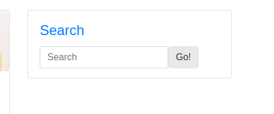
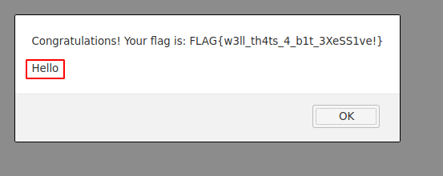
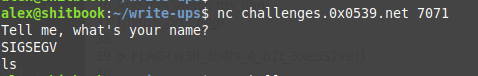
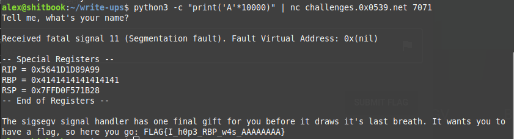
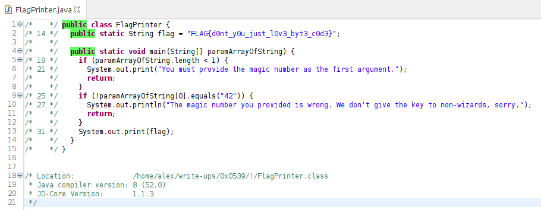

#0x0539 notes

## Look at it
I am given the string  `D7B9{9B7D_D7B9_DD77BB99}` and can tell this some sort of readable cipher text. The ciphertext 
uses numbers so I rule out ROT13 or Substitution ciphers.

The flag submission box gives us a hint that the flag will be in the format FLAG{...} so using that we can instantly
decode the FLAG as D789 and working off of that crudely decode the flag by hand
```
D - F
7 - L
B - A
9 - G

9B7D_D7B9_DD77BB99
GALF_FLAG_FFLLAAGG
```
Wrapping the decoded in FLAG{} gives us 
> FLAG{GALF_FLAG_FFLLAAGG}

## Here be dragons
The flag gives me a clue that it will be an HTML comment ` <!-- FLAG{} --> `
So I quickly look through the source code of the page scanning for green lines and find it
> <\!-\- FLAG{5L4Y3R_0F_DR4G0NS} -\->

## Excessive Alert
The title gives me a clue that I could possibly use XSS in order to make a js alert pop-up which is a popular way to solve these challenges. I saw a search box which could be used to submit my payload. I didn't know any payloads off the top of my head but quickly reviewed them here, [payloads](https://owasp.org/www-community/xss-filter-evasion-cheatsheet).
There's a search box which can be used to submit a payload 

And I settle on a simple payload which is an alert box which echoes "Hello"
` <SCRIPT>javascript:alert('Hello')</SCRIPT> `

And this yields my flag along with my 'Hello'


> FLAG{w3ll_th4ts_4_b1t_3XeSS1ve!}

## SIGSEGV
Given a server and port to connect to
`nc challenges.0x0539.net 7071`
Which prompts me for my name

and then terminates the program after receiving one additional line of text. I wasn't familiar with the SIGSEGV signal so some quick googling reveals it mean segmentation fault which makes me think I need to do a buffer overflow. 

I play around with some payloads in python and settle upon a ridiculous number of ten-thousand A's which are piped into netcat and I get a flag from the death throes of the signal handler.

> FLAG{I_h0p3_RBP_w4s_AAAAAAAA}

## Baby's First Bytecode
I'm given a java class file which I learn needs to be decompiled as a java file in order to run correctly so I decompile it using JD-GUI which gives me the source code:

Now we see the flag in plain-text but that's no fun getting the flag without at least running the program so I compile it in bash `javac FlagPrinter.java`and run the program with an argument of 42 which spits out the flag
> FLAG{d0nt_y0u_just_l0v3_byt3_c0d3}

